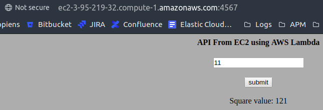
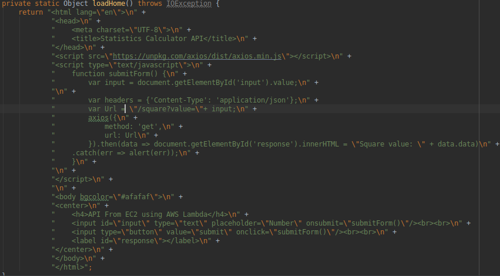
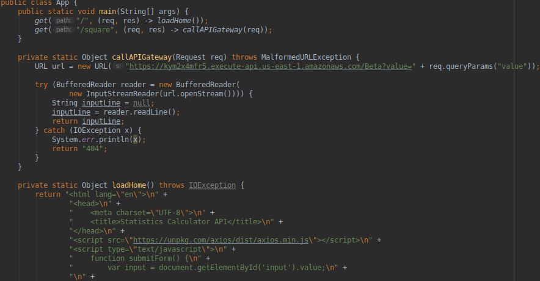

# Server Web with Lambda and EC2

## Description

 Server that uses AWS infrastructure
 
### Evidence
#### Use
 
#### HTML code
 
#### Server call
 
      
### Built with

 * [Java](https://www.java.com) - programming language
 * [Git](https://git-scm.com) - distributed version-control system for tracking changes in source code
 * [Maven](https://maven.apache.org) - project management and build automation tool

## Author

 * **[Sergio Rodríguez](https://github.com/SergioRt1)**
 
## License

This project is licensed under the Apache-2.0 License - see the [LICENSE](LICENSE) file for details